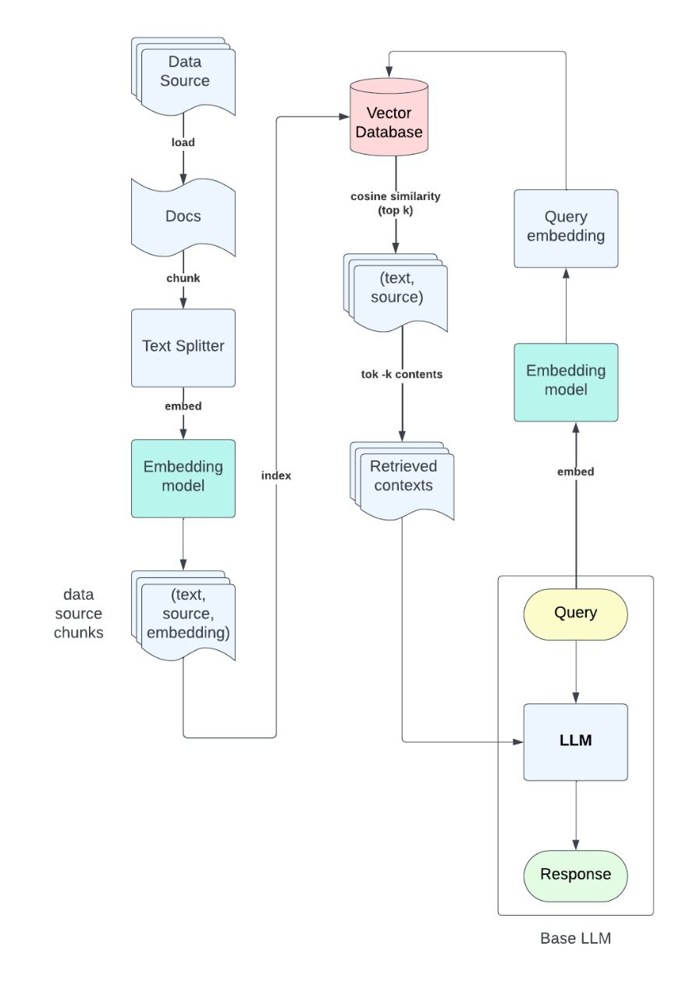
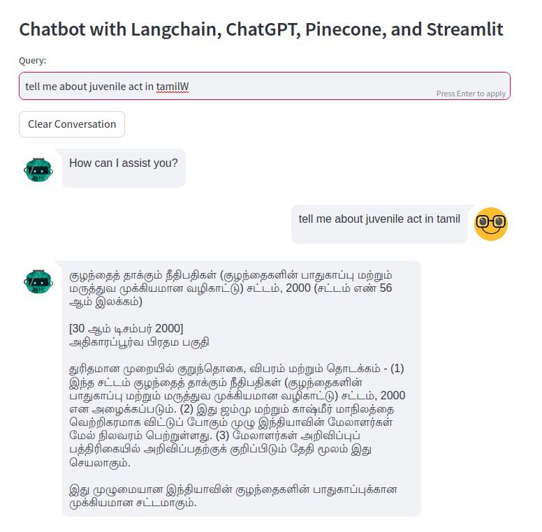

# LangChain Legal Chatbot
# Overview
LangChain Chatbot is a conversational AI system designed to assist users with legal queries and provide relevant information. It utilizes various natural language processing techniques, including OpenAI's GPT-3.5 model, Sentence Transformers, and Pinecone indexing, to understand user queries, refine them, and find the most relevant responses.




# Components
# - utils.py
This module contains utility functions and setup for the chatbot system. Here's an overview of its functionalities:

- OpenAI API Setup: Sets up the OpenAI API key.
- SentenceTransformer Model Initialization: Initializes the SentenceTransformer model for encoding text.
- Pinecone Index Initialization: Initializes the Pinecone index for storing and querying text embeddings.
- Functions for Query Refinement and Finding Matches: Includes functions to refine user queries using OpenAI's Completion API and find the most relevant matches in the Pinecone index.
- Transliteration Function: Provides a function to transliterate Tamil text to English.
  
# - app.py
This module implements the Streamlit app for interacting with the chatbot. Here's a summary of its features:

- Streamlit Setup: Sets up the Streamlit interface.
- Initialization of ChatOpenAI and Conversation: Initializes the chatbot model and conversation chain using ChatOpenAI and ConversationChain classes.
- User Input Handling: Allows users to input queries and submits them to the chatbot.
- Conversation History Display: Displays the conversation history between the user and the chatbot.

# - ML_Langchain_Pinecone_Indexing.ipynb
This Jupyter Notebook demonstrates the setup and usage of Pinecone for indexing and retrieving similar documents based on user queries. It includes functions to load documents, split them into chunks, initialize embeddings, and create a Pinecone index. Additionally, it provides a function to retrieve similar documents based on a user query.

# Usage
Setting Up Environment:
Install the required dependencies specified in requirements.txt.
```python
pip install -r requirements.txt
```
Set up environment variables for OpenAI and Pinecone API keys.

# Running the Application:
```python
streamlit run app.py
```
Interact with the chatbot by inputting queries in the provided text input field.


Utilizing Pinecone for Document Retrieval (Optional):
Execute the code in pinecone.ipynb to demonstrate document indexing and retrieval using Pinecone.

# Requirements
- Python 3.x
- Streamlit
- Sentence Transformers
- Pinecone
- OpenAI API key
- Pinecone API key

# LICENSE
Check License file
